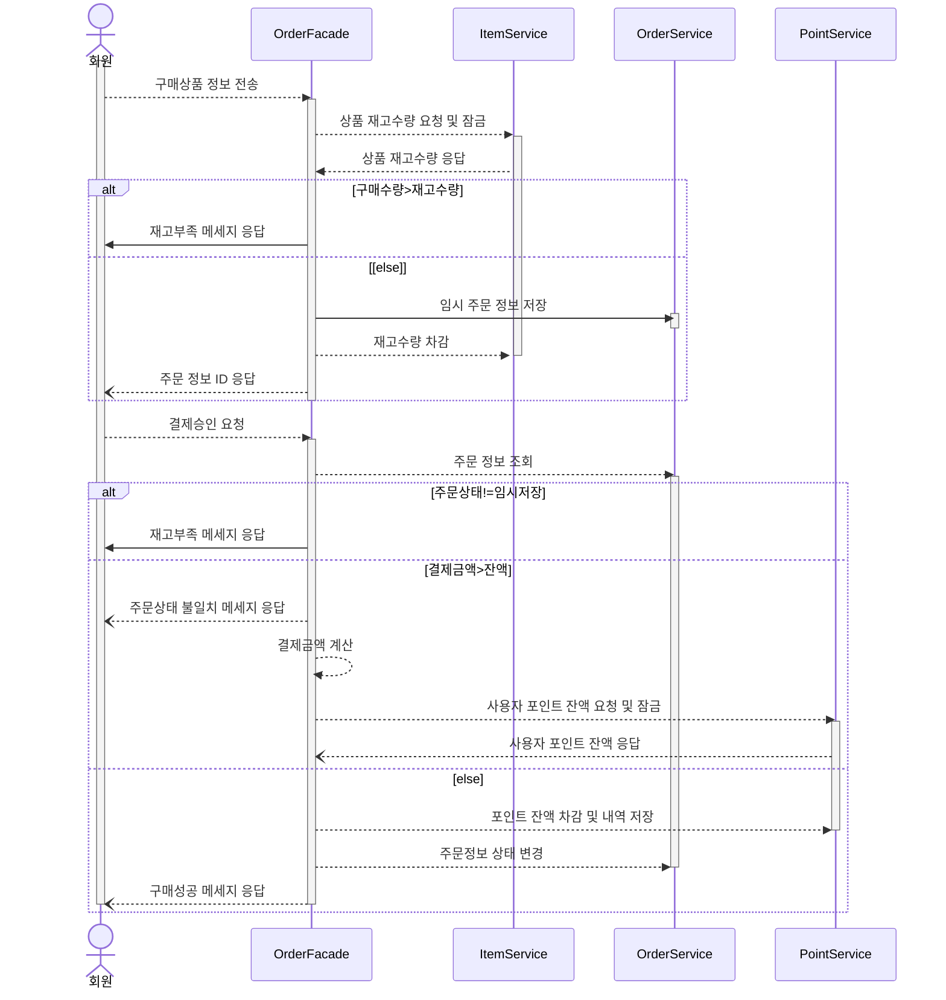

```mermaid
sequenceDiagram
    actor 회원
    activate 회원
    회원-->>OrderFacade: 구매상품 정보 전송
    activate OrderFacade
    OrderFacade-->>ItemService: 상품 재고수량 요청 및 잠금
    activate ItemService
    activate ItemService
    ItemService-->>OrderFacade: 상품 재고수량 응답
    alt 구매수량>재고수량
        OrderFacade->>회원: 재고부족 메세지 응답
    else [else]
        OrderFacade->>OrderService: 임시 주문 정보 저장
        activate OrderService
        deactivate OrderService
        OrderFacade-->>ItemService: 재고수량 차감
        deactivate ItemService
        OrderFacade--)회원: 주문 정보 ID 응답
    end
    deactivate OrderFacade
    회원-->>OrderFacade: 결제승인 요청
    activate OrderFacade
    OrderFacade-->>OrderService: 주문 정보 조회
    activate OrderService
    alt 주문상태!=임시저장
        OrderFacade->>회원: 재고부족 메세지 응답
    else 결제금액>잔액
        OrderFacade--)회원: 주문상태 불일치 메세지 응답
        OrderFacade-->>OrderFacade: 결제금액 계산
        OrderFacade-->>PointService: 사용자 포인트 잔액 요청 및 잠금
        activate PointService
        PointService--)OrderFacade: 사용자 포인트 잔액 응답
    else else    
        OrderFacade-->>PointService: 포인트 잔액 차감 및 내역 저장
        deactivate PointService
        OrderFacade-->>OrderService: 주문정보 상태 변경
        deactivate OrderService
    OrderFacade--)회원: 구매성공 메세지 응답
    deactivate OrderFacade
    deactivate 회원
    end
```